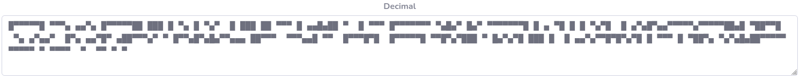

# The Square (500p)
## Challenge Description  

<em> During a daring raid on the underground AI HQ, our team uncovered a series of encrypted messages used by the evil AI Wintermute. These messages are key to unveiling Wintermute's plans and contain hidden secrets that could turn the tide in our favor.

Your mission is to decode these secret messages. If decoded correctly, they might lead you to a surprising and crucial discovery. Follow the clues, use your programming skills, and find out what Wintermute is hiding.

Author: Jimmy Johansson - bearbetning@outlook.com  
File: [xcript.txt](../helper/xcript.txt)</em>

## Thought Process
- The comment provided in the code is a little missleading as it gave me the impression that you only need to change things in the for-loop. This turned out not to be true.
- I initially thought it may have had something to do with squaring numbers (based on function name and challenge title), perhaps squaring by `i` for each iteration in the loop, but the numbers would quickly grow very large.
- I suspected some operation(s) had to be done on the numbers, such as a mathematical operation dependent on the loop counter, as four unique numbers probably would not be able to make out a meaningful message (this turned out to be false as four numbers could indeed produce a meaningful message, just not how I thought).

## Solution
1. We see that we are dealing with Python code. After studying the code a bit, it remains unclear what should be done. I turn my attention to the data list we are given.
2. There are only four unique numbers in the list: 9608, 9604, 9600 and 160. I feed this list to [Cyberchef](https://gchq.github.io/CyberChef/) and [CacheSleuth's Multi Decoder](https://www.cachesleuth.com/multidecoder/); my goto apps for dealing with a cipher. Cyberchef's "Magic" was not useful here, but scrolling down in the Multi Decoder I see something that immediately catches my attention and makes me think of a QR code: .
3. The Python operation which achieves this transformation is `chr()`, so I add `td = chr(d)` in the loop. The output is now starting to resemble a QR code, but it's too elongated. From understanding the code, I know I need to fiddle around with the `b` value to change this. I set `b=24` which produces the QR code when ran. Scanning it gives the flag.
4. I had some trouble scanning the QR code as the IDE I was using (PyCharm) had too much line spacing in the output after a newline. Running the program in the Linux terminal fixed this.
